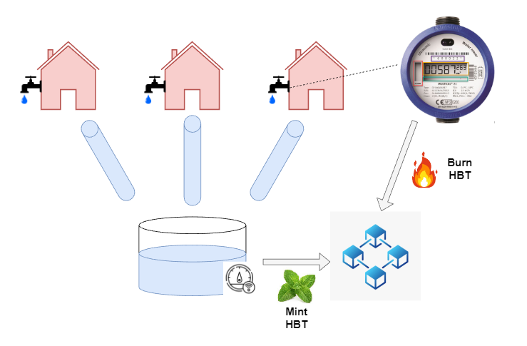

## 02. HydroBlox Solution

HydroBlox offers a solution to control the drinkwater usage and incentivizes users to be frugal, especially during periods of droughts.
Small consumers will be rewarded, large consumers will be confronted with larger fees.
HydroBlox tokens (HBT) will be used to create the right economic environment.

The amount of HydroBlox tokens will always represent the amount of available drinkable water.
During periods of influx (pumping of groundwater, rainfall, ...) tokens will be created (minted), equal to the amount of water that became available.
These tokens will immediately be divided among the users.
While consuming water, tokens will be destroyed (burned).
Each consumer pays a fixed price to receive HBT tokens during a fixed period in time.
This amount covers all costs: filtering, infrastructure, transport, ...

During periods of draughts, there is less or no influx of new water. So little or no tokens are minted.
Large consumers, running out of tokens, will need to buy tokens from small consumers.
This ensures that small consumers are rewarded for their efforts and large consumers are presented the bill.

In order to make our solution secure and tamperproof, we rely on smart digital water meters, for both production and consumption.
These water meters each have a wallet and run a small piece of software, that allows them to integrate with our smart contracts.
Each water meter has a distributed identity (DID) to identity itself as a certified and eligble consumption or production meter.

When a consumption meter is assigned to a consumer (delivery address), the DID is updated so it reflects the number of people living there.
Once the consumer has approved the consumption meter to spend ether on his behalf, consumption can start.

### HydroBlox Tokenomics

The HydroBlox tokens are transferable, in combination with smart contracts running on a blockchain this allows to create the right economics to achieve multiple goals. The system has a number of objectives in mind:
1. In times of scarcity, i.e. droughts, the tokens should get more costly. This is to create the correct economic incentives for consumers, a large consumer will see that his behaviour comes at a cost
2. The smart contracts should prevent speculative behaviour and unnecessary hoarding of tokens, this to avoid price fluctuations which will increase trust
3. Ensure basic access to water needs to be guaranteed

#### Solution

We came up with a solution which tries to meet the above objectives. At the start of Hydroblox a liquidiy pool wil be created where HBT and another native token e.g ETH is deposited. When a consumption meter has an oversupply of HBT, it will automatically sent a part of these tokens to the pool but based on the consumer's past usage, it would still conserve enough tokens to cover its own demand for a certain period. In exchange for sending HBT to the pool the consumer will get a certain amount of native token back from the pool. On the other hand, the consumption meter will also automatically buy HBT from the pool in exhange for the native token when it is running out of HBT.

The price of an HBT token will be determined by an automated market maker which is essentially an algorithm based on the ratio of HBT to the native token in the pool.

If the price of HBT increases due to a draught or high demand large consumers will tend to consume less water as it becomes costly to buy HBT, bringing demand down. Small consumers are also encourged to be extra frugal as they will receive a high price if they would have an oversupply of HBT, bringing new HBT into the pool which drives the prices down again. This will bring a new market equilibrium based on the law of supply and demand.
 
Our solution differs from a normal liquidity pool in the sense that no tokens can be bought or sold manualy and that there is cap on the amount of tokens one can have.
This in order to prevent speculation and ensure that no hoarding of HBT can take place.

A formalized version of the automated market maker could look as follows:

Amount of HBT * amount of native token= K   With K a constant

This formula gives us the price of a HBT:   1 HBT= $\frac{K}{1nativeToken}$

 
The oversupply of HBT for each consumer at a time T can be defined as as having more tokens then needed to cover X amount time of water usage, based on an average of the usage in the past.

In the above example the predicted water usage for X amount of time for consumer C at time T is 4000 HBT. If Consumer C would have more then 4000 HBT then these "oversupply" tokens will be sent to the pool. In exhange she/he will reveice back a certain amount native of tokens determined by the automated market maker as decribed above.
